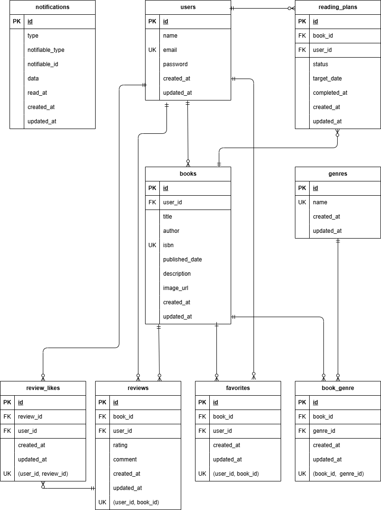

# BookShelf 書籍レビューアプリ

## 概要

### プロジェクトの目的
「読みたい本を探す」だけでなく、読書後の評価や記録、次に読む本の計画まで一つのサービスで管理できることを目的とした書籍レビューアプリです。

書籍の検索・登録、レビューやお気に入りによる記録に加え、評価ランキングや読書レポートによって自分の読書傾向を振り返り、読書計画やリマインダー通知によって継続的な読書をサポートできるよう設計しています。

また、ユーザーが登録した書籍やレビューを扱うため、認証・認可を適切に行い、APIではLaravel Sanctumによるトークン認証を導入するなど、実際のWebアプリケーションを想定した設計・実装を意識しました。

### 主な機能
- 会員登録・ログイン・ログアウト
- 書籍の登録・編集・削除・検索・絞り込み・ソート
- ISBNによるGoogle Books APIとの連携
- レビュー投稿・編集・削除、レビューへのいいね
- お気に入り登録・解除
- ジャンル管理
- 評価ランキング
- マイ読書レポート
- 読書計画の作成・進捗管理
- 読書計画に応じたリマインダー通知
- 日次バッチによる読書計画の自動処理
- Laravel Sanctumによる書籍API

## 環境構築

1. リポジトリをクローン
```bash
git clone git@github.com:urbexsaku/bookshelf-app.git
cd bookshelf-app
```

2. 環境変数ファイル`.env`を作成
```bash
cp .env.example .env
```

3. Composer 依存のインストール（Docker 経由）
```bash
docker run --rm \
    -u "$(id -u):$(id -g)" \
    -v "$(pwd):/var/www/html" \
    -w /var/www/html \
    laravelsail/php82-composer:latest \
    composer install
```

4. Sailの起動
```bash
./vendor/bin/sail up -d
```
> （任意）以下のエイリアスを設定すると、`./vendor/bin/sail` の代わりに `sail` コマンドを使用できます。
> ```bash
> alias sail='[ -f sail ] && bash sail || bash vendor/bin/sail'
> ```

5. アプリケーションキーの生成
```bash
sail artisan key:generate
```

6. データベース作成と初期データの投入
```bash
sail artisan migrate --seed
```

7. フロントエンドアセットのビルド
```bash
sail npm install
sail npm run build
```

8. Google Books APIの設定

ISBN検索機能を利用するため、Google Books APIのAPIキーを設定します。

- Google Cloud Consoleでプロジェクトを作成
- Books APIを有効化
- APIキーを作成
- `.env`にAPIキーを設定
```env
GOOGLE_BOOKS_API_KEY=取得したAPIキーをここに入力
```

## 使用技術 

- PHP 8.5
- Laravel 10.10
- MySQL 8.4
- Laravel Sail (Docker)
- Laravel Fortify
- Laravel Sanctum
- Vite
- PHPUnit
- Laravel Pint
- Google Books API

## ER図



## 開発環境URL

- アプリケーション：http://localhost/
- phpMyAdmin：http://localhost:8080

## テスト用アカウント

| ユーザー名 | メールアドレス | パスワード | 
|----------|----------------|------------|
| 山田太郎 | yamada@example.com | password | 
| 鈴木花子 | suzuki@example.com | password | 
| 田中一郎 | tanaka@example.com | password | 
| 佐藤美咲 | sato@example.com | password | 
| 高橋健太 | takahashi@example.com | password | 

## APIエンドポイント

| メソッド | エンドポイント | 概要 | 認証 |
|----------|----------------|------|------|
| GET | `/api/v1/books` | 書籍一覧を取得 | 不要 |
| GET | `/api/v1/books/{book}` | 書籍詳細を取得 | 不要 |
| POST | `/api/v1/books` | 書籍を登録 | Sanctum |
| PUT | `/api/v1/books/{book}` | 書籍を更新 | Sanctum |
| DELETE | `/api/v1/books/{book}` | 書籍を削除 | Sanctum |

## テスト

PHPUnitによるFeature Test・Unit Testを実装しています。

- 認証・認可
- 書籍管理
- レビュー
- お気に入り
- ジャンル
- ランキング
- 読書計画
- 通知
- API
- バリデーション

**テストカバレッジ：90.3%**

## 設計書

詳細な設計については、以下の設計書を参照してください。
- [テーブル仕様書](https://docs.google.com/spreadsheets/d/1zV78Kb_cwhvQeeF6i0mSknEJVgz1ZVC-BIKM4XA1GCQ/edit?pli=1&gid=1988632272#gid=1988632272)
- [基本設計書](https://docs.google.com/spreadsheets/d/1zV78Kb_cwhvQeeF6i0mSknEJVgz1ZVC-BIKM4XA1GCQ/edit?pli=1&gid=1788455337#gid=1788455337)  
- [API設計書](https://docs.google.com/spreadsheets/d/1zV78Kb_cwhvQeeF6i0mSknEJVgz1ZVC-BIKM4XA1GCQ/edit?pli=1&gid=1496196971#gid=1496196971)
- [テスト設計書](https://docs.google.com/spreadsheets/d/1zV78Kb_cwhvQeeF6i0mSknEJVgz1ZVC-BIKM4XA1GCQ/edit?pli=1&gid=1607424817#gid=1607424817)

## 作成者

Yuki (urbexsaku)
